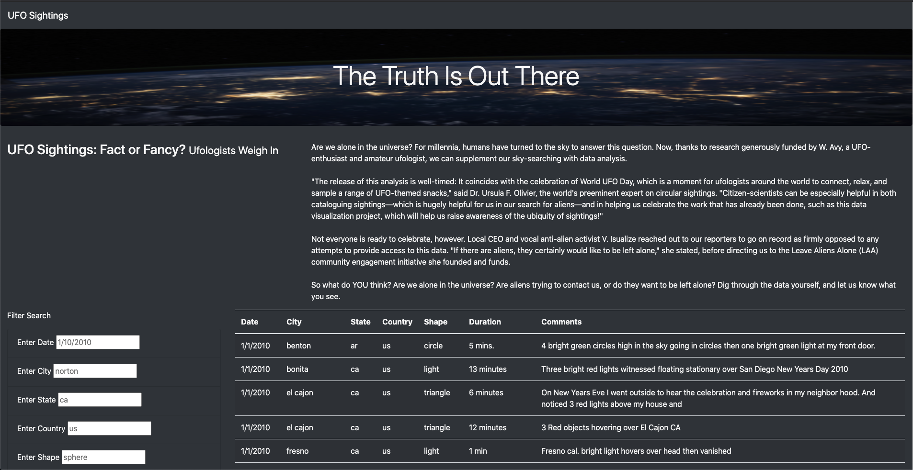
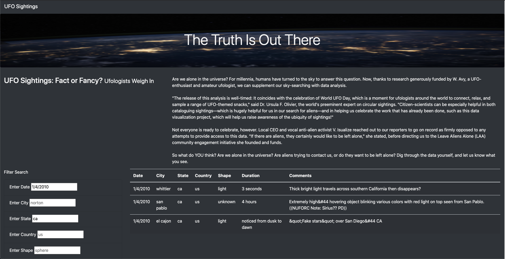

# UFOs
JavaScript and HTML files for display and filtering of UFO sighting data.

## Overview of the Project
This project includes a webpage to display and filter UFO sighting reports
contained in the file [data.js](static/js/data.js). This file includes the
JavaScript object `data` with keys `datetime`, `city`, `state`, `country`,
`shape`, `durationMinutes`, and `comments`. In addition, this repository
includes [index.html](index.html) which leverages Bootstrap CSS and our custom
[style.css](static/css/style.css) to create the page layout and
[app.js](static/js/app.js) to read the input data, filter according to user
inputs, and build the resulting tables.

### Resources
- Data Sources:
    - [data.js](static/js/data.js)
- Software:
    - D3.js 4.11.0
    - Bootstrap 4.0.0
    - Visual Studio Code 1.51.1

## Results
### [UFO Finder](https://jsheppard95.github.io/UFOs/index.html)
The link above opens to the following home page:

To filter results, enter one or more search criteria in the "Filter Search"
section. For example we find there were three sightings in
California on 1/4/2010 included in this dataset:

Remove any applied filters by deleting text from the "Filter Search" section,
or clear all active filters by selecting "UFO Sightings" in the top left
corner.

## Summary
We thus have a functional webpage to filter and display UFO sightings
contained in [data.js](static/js/data.js). One drawback to these additional
filters however is we have increased clutter below the page's title and
description paragraph. This could be improved with additional formatting
constraints in [style.css](static/css/style.css) such as uniform column
spacing for the "Filter Search" section. Another possible improvement could be
to add tooltips to the search criteria so that as filters are
entered, the page could display possible options that give matching results.
